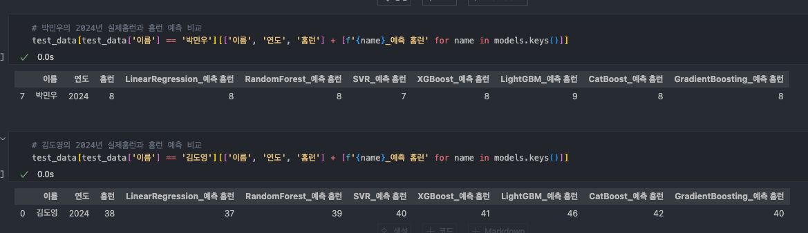

# KBO Hitters HomeRun Analysis & Prediction Using ML
This repo is a term project from the “Statistics for AI” major class at Pusan National University. 

## About
This repo uses KBO hitter data from 1982 to 2023 to analyze the home runs of 2024 hitters using machine learning methods.This project is implemented in Python.

## Libraries
You will need the following Python libraries.
- pandas, numpy
- seaborn, matplotlib
- requests
- BeautifulSoup
- tqdm
- scikit-learn, xgboost, shap, lightgbm, catboost, statsmodels

```bash
pip install pandas numpy seaborn matplotlib requests beautifulsoup4 tqdm scikit-learn xgboost shap lightgbm catboost statsmodels
```

## Files
1. dataParsing.ipynb
> A file that collects data from the web and saves it as a CSV file.

2. HomeRunPrediction.ipynb
> A file that uses data EDA and ML methods to conduct analysis.

## Example


> Predictions from the MVP of the 2024 season (DY Kim) and the captain of the NC Dinos (MW Park).

## Related Links
* https://statiz.sporki.com/stats/